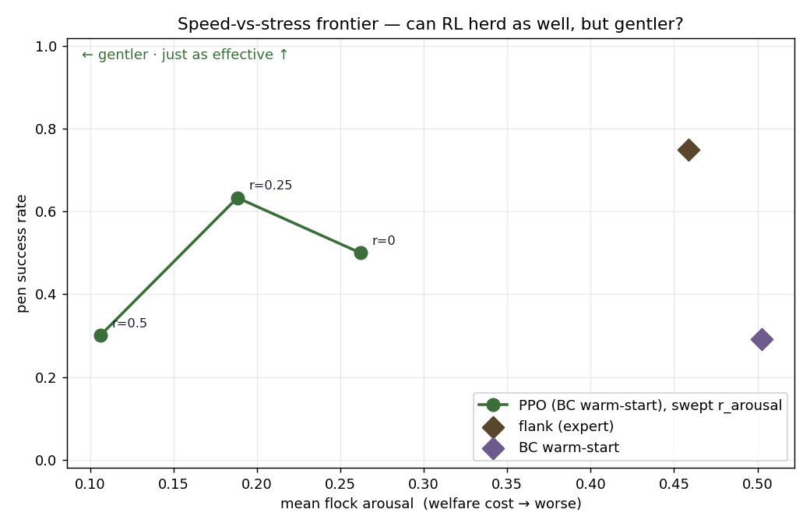

# P2 results — RL discovers *gentler* herding than the textbook

First end-to-end result of the thesis: an RL shepherd that pens nearly as well as the
classic Strömbom heuristic while inflicting far less flock stress.



## The frontier (30-seed eval, each run's best checkpoint)

| policy | pen success | mean flock arousal | note |
|---|---|---|---|
| **flank** (Strömbom expert) | 75% | 0.459 | the textbook bar |
| **PPO `r=0.25`** | **63%** | **0.188** | ~as effective, **~59% less stress** |
| PPO `r=0` | 50% | 0.262 | |
| PPO `r=0.5` | 30% | 0.106 | gentlest, but over-passive |
| BC warm-start | 29% | 0.503 | where fine-tuning began |

**Headline:** the welfare weight `r_arousal` traces a real **speed-vs-stress frontier**.
The sweet spot (`r=0.25`) herds almost as well as the expert at **less than half the stress.**

**Secondary finding:** `r=0.25` beats `r=0` on *both* axes — a little gentleness is also
*more effective*, because pressing too hard scatters the flock (mirrors Grandin's
low-stress-handling wisdom). Over-penalise (`r=0.5`) and it goes too passive → success drops.

**Why this worked:** PPO from scratch could not learn the task (≈16% success, flat — see
the failed `learning_curve_ra0.png`). Behaviour-cloning the flank heuristic past the
exploration wall, then fine-tuning for welfare, was the unlock.

## Honest caveats

- **Thin & noisy:** 30-seed eval (±~9%), one seed per welfare weight, 3 points only.
- **Unstable fine-tuning:** runs peak then drift, so these are *best-checkpoint* policies
  (what you'd deploy), not converged. A KL-limit / lower LR would stabilise.
- **Model not yet data-calibrated:** the arousal model is literature-grounded (flight-zone),
  not fit to real ear-angle data — see `docs/data-roadmap.md` (Rung 3 is the digital-twin step).

## Footage (in `out/`, regenerate with the scripts)

- `showcase_compare.gif` — flank vs BC vs gentle PPO on one seed (sheep tinted by stress).
- `ghost_compare_ra0.25_bc.gif` — one run learning: frantic early checkpoint → calm 8/8.
- `ghost_paths.png` — the dog's path across training checkpoints (red early → green late).

## Reproduce

```bash
.venv/bin/python scripts/bc.py                                  # clone flank → out/bc_actor.pt
for w in 0.0 0.25 0.5; do
  .venv/bin/python scripts/train.py --init out/bc_actor.pt --r_arousal $w --steps 1500000
done
.venv/bin/python scripts/pareto.py                              # frontier figure
.venv/bin/python scripts/showcase.py --tag ra0.25_bc            # comparison footage
.venv/bin/python scripts/ghost.py   --tag ra0.25_bc            # evolution footage
```
